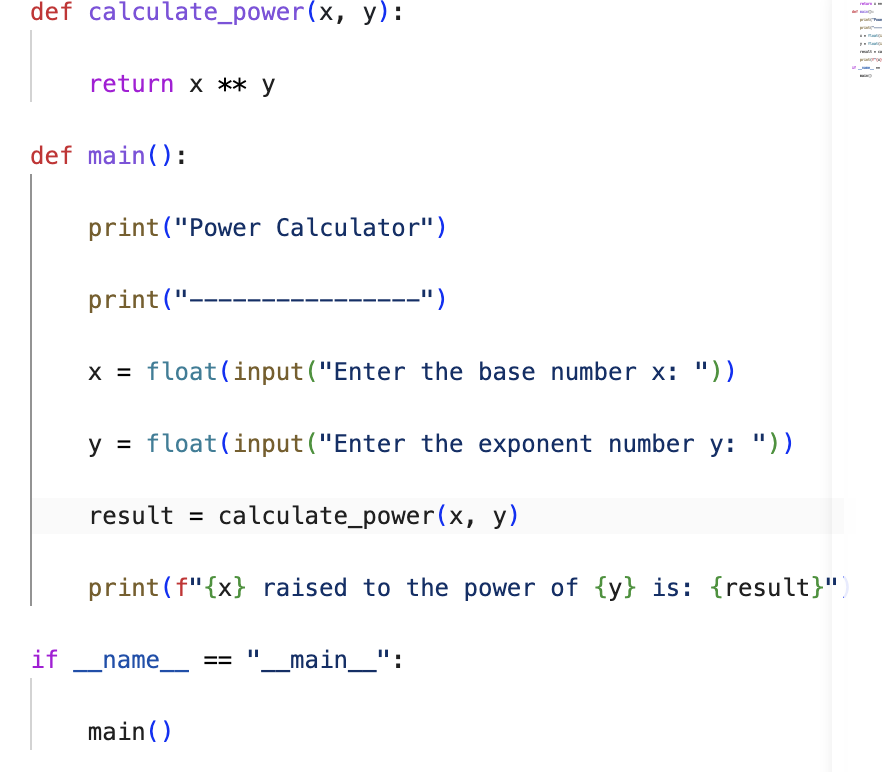
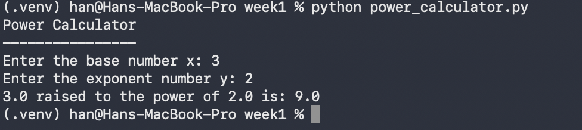

# MSE800-PSD Week 1 Activity 3

## Project Title

Power Calculator

## Description

This is my first Python project developed for Week 1 Activity 3. The program calculates the power of two numbers. Users enter a base number (x) and an exponent number (y), and the program returns the result of x raised to the power of y.

## Technologies Used

- Python 3.14.5
- Visual Studio Code
- macOS Terminal
- GitHub

## How to Run

Activate the virtual environment:

bash source ../.venv/bin/activate 

Run the program:

bash python power_calculator.py 

## Example Output

text Power Calculator ---------------- Enter the base number x: 3 Enter the exponent number y: 2 3.0 raised to the power of 2.0 is: 9.0 

## Screenshot

Insert a screenshot showing:
- VS Code with the source code

- Terminal with the program output

## Author

Han