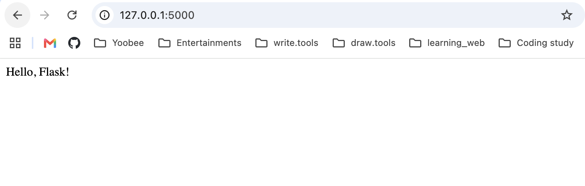

Week 12 - Activity 1.1: Hello Flask

Student

Han Jia

Project

Hello Flask

Description

This project is a simple Flask web application. It displays the message “Hello, Flask!” when the home page is opened in a web browser.

Technologies Used

* Python 3.14
* Flask

How to Run

1. Create a virtual environment:

python3 -m venv .venv

2. Activate the virtual environment:

source .venv/bin/activate

3. Install Flask:

pip install flask

4. Run the application:

python hello_flask.py

5. Open your browser and visit:

http://127.0.0.1:5000

Output

The application displays:

Hello, Flask!

What I Learned

* How to install Flask
* How to create a simple Flask application
* How to run a local web server
* How to access the application in a web browser