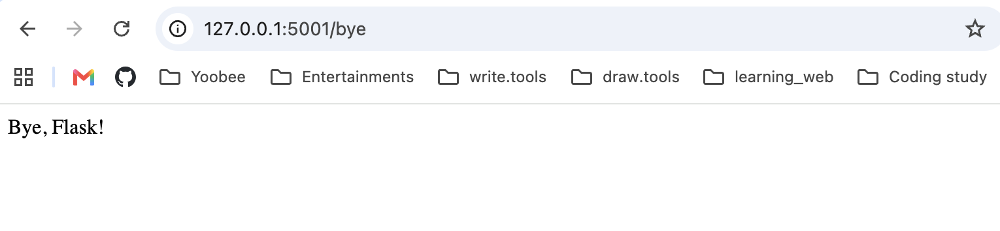

# Week 12 - Activity 1.2: Flask Routes

## Student

Han Jia

## Project

Week12 activity1.2

## Description

This project updates the Hello Flask application by adding a new route.

The application has two pages:

- `/` displays **Hello, Flask!**
- `/bye` displays **Bye, Flask!**

## Technologies Used

- Python 3.14
- Flask

## How to Run

1. Activate the virtual environment:

```bash
source .venv/bin/activate
```

2. Run the application:

```bash
python app.py
```

3. Open your browser:

```
http://127.0.0.1:5001/
```

Home page:

```
Hello, Flask!
```

Second page:

```
http://127.0.0.1:5001/bye
```

Output:

```
Bye, Flask!
```

## Files

```
activity1.2/
├── app.py
├── README.md
├── output_home.png
└── output_bye.png
```

## Screenshot



## What I Learned

- How to create multiple Flask routes.
- How to display different web pages.
- How to run a Flask application locally.
- How to test different URLs in a browser.