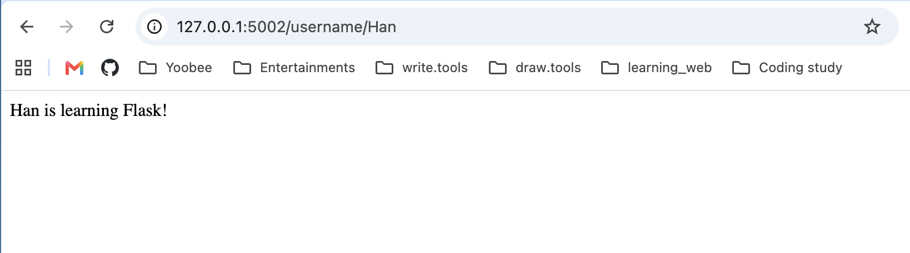

# Week 12 - Activity 1.3: Flask Variable Path

## Student

Han Jia

## Project

week12 activity 1.3

## Description

This project updates the Flask application by adding a variable path.

The application has three routes:

- `/` displays **Hello, Flask!**
- `/bye` displays **Bye, Flask!**
- `/username/<name>` displays **<name> is learning Flask!**

## Technologies Used

- Python 3.14
- Flask

## How to Run

1. Activate the virtual environment:

```bash
source .venv/bin/activate
```

2. Run the application:

```bash
python flask_name_variable.py
```

3. Open your browser:

Home page:

```
http://127.0.0.1:5002/
```

Second page:

```
http://127.0.0.1:5002/bye
```

Variable path example:

```
http://127.0.0.1:5002/username/Han
```

## Output

- `/` → Hello, Flask!
- `/bye` → Bye, Flask!
- `/username/Han` → Han is learning Flask!

## Screenshot



## What I Learned

- How to create multiple Flask routes.
- How to use a variable path.
- How Flask passes URL values to a Python function.
- How to test different routes in a web browser.