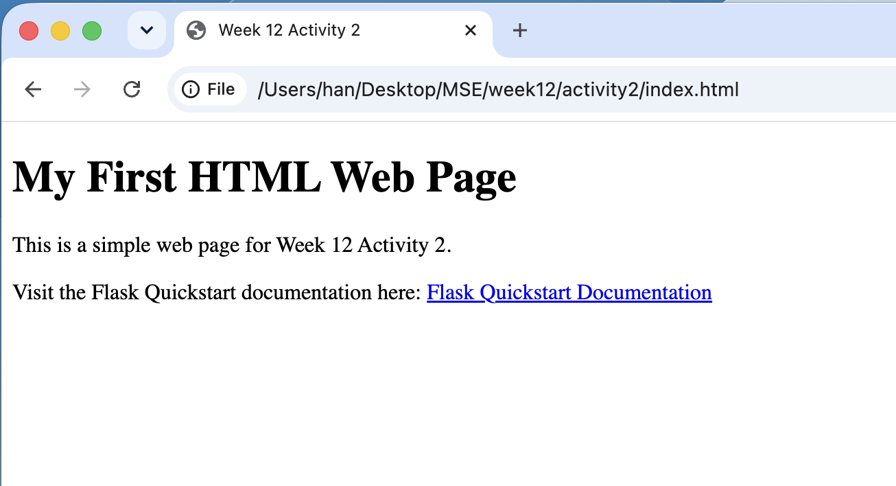

# Week 12 - Activity 2: HTML

## Student

Han Jia

## Project

Week12 activity2 Simple HTML Web Page

## Description

This project creates a simple HTML web page with a title, a heading, and a link to the Flask Quickstart documentation.

## Technologies Used

- HTML

## How to Open

Open the `index.html` file in a web browser.

## Features

- Web page title
- Heading
- Paragraph
- Link to the Flask Quickstart documentation

## Screenshot

## What I Learned

- How to create a basic HTML page.
- How to use the `<title>` tag.
- How to use the `<h1>` tag.
- How to use the `
` tag.
- How to create a hyperlink using the `<a>` tag.