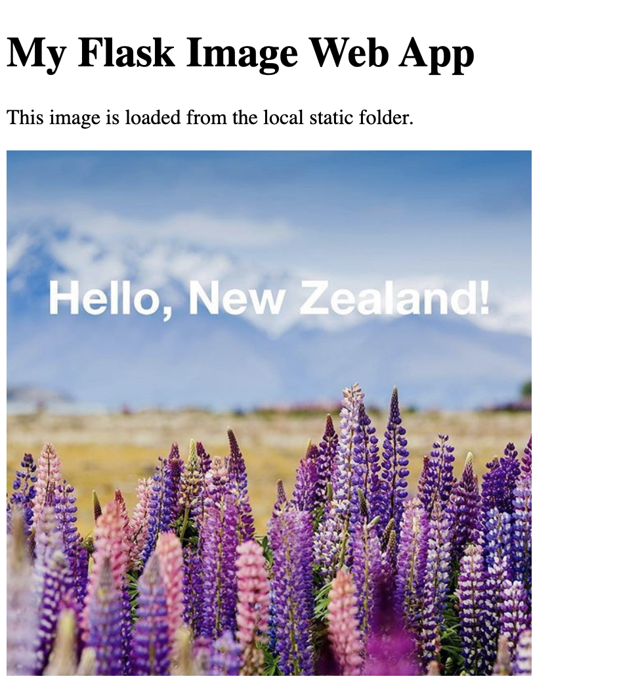

# Week 12 - Activity 4: Flask Image Display

## Student

Han Jia

## Project

Flask Image Display

## Description

This project is a simple Flask web application that loads and displays an image from the local system.

## Technologies Used

- Python 3.14
- Flask
- HTML

## How to Run

1. Activate the virtual environment:

```bash
source .venv/bin/activate
```

2. Run the application:

```bash
python app.py
```

3. Open your browser:

```
http://127.0.0.1:5004/
```

## Features

- Display a local image.
- Use Flask to load an HTML page.
- Load the image from the `static` folder.

## Screenshot



## What I Learned

- How to create a Flask web application.
- How to use the `templates` folder.
- How to use the `static` folder.
- How to display an image in HTML using Flask.