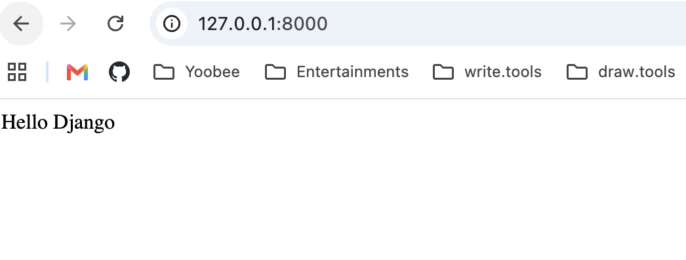

# Week 14 - Activity 1.2: Hello Django

## Student

Han Jia

## Project

Hello Django

## Description

This project is a simple Django web application that displays **"Hello Django"** in a web browser.

## Technologies Used

- Python 3.14
- Django 6.0.7

## How to Run

1. Activate the virtual environment:

```bash
source .venv/bin/activate
```

2. Start the Django server:

```bash
python manage.py runserver
```

3. Open your browser:

```
http://127.0.0.1:8000/
```

## Features

- Display "Hello Django"
- Basic Django project
- Simple URL routing
- Simple view using `HttpResponse`

## Screenshot



## What I Learned

- How to create a Django project.
- How to create a Django app.
- How to configure URLs.
- How to create a view.
- How to run a Django development server.