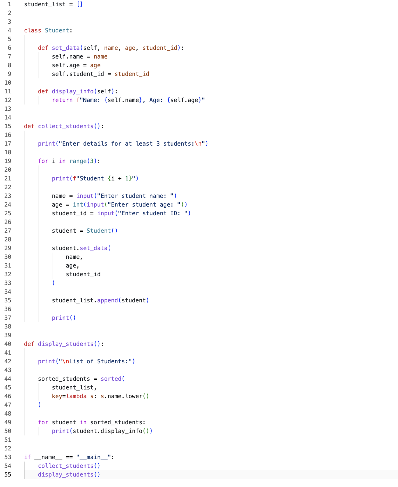
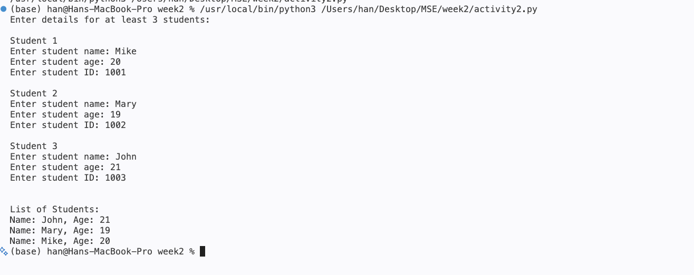

# Week 2 - Activity 2

## Class and Functions, Local and Global Variables

### Student Information Management System

## Introduction

This project demonstrates the use of classes, functions, local variables, and global variables in Python. The program allows users to enter the name, age, and student ID of at least three students. The student information is stored in objects and displayed in alphabetical order by student name.

## Technologies Used

- Python 3
- VS Code
- Git and GitHub

## Features

- Collect student name
- Collect student age
- Collect student ID
- Store student information using a class
- Use a global list to store student objects
- Display students in alphabetical order
- Demonstrate local and global variables

## Program Structure

### Class

Student

### Functions

1. collect_students()
   - Collects student information from the user.

2. display_students()
   - Sorts and displays student information.

### Global Variable

python student_list = [] 

Stores all student objects.

### Local Variables

python name age student_id student 

These variables exist only within functions.

## Sample Output

text Student 1 Enter student name: Mike Enter student age: 20 Enter student ID: 1001  Student 2 Enter student name: Mary Enter student age: 19 Enter student ID: 1002  Student 3 Enter student name: John Enter student age: 21 Enter student ID: 1003  List of Students:  Name: John, Age: 21 Name: Mary, Age: 19 Name: Mike, Age: 20 

## Python Entry Point

python if __name__ == "__main__":     collect_students()     display_students() 

This ensures the program runs only when the file is executed directly.

## Screenshots

### Code Screenshot

### Terminal Screenshot

## GitHub Repository

GitHub link:
(Add your repository link here.)