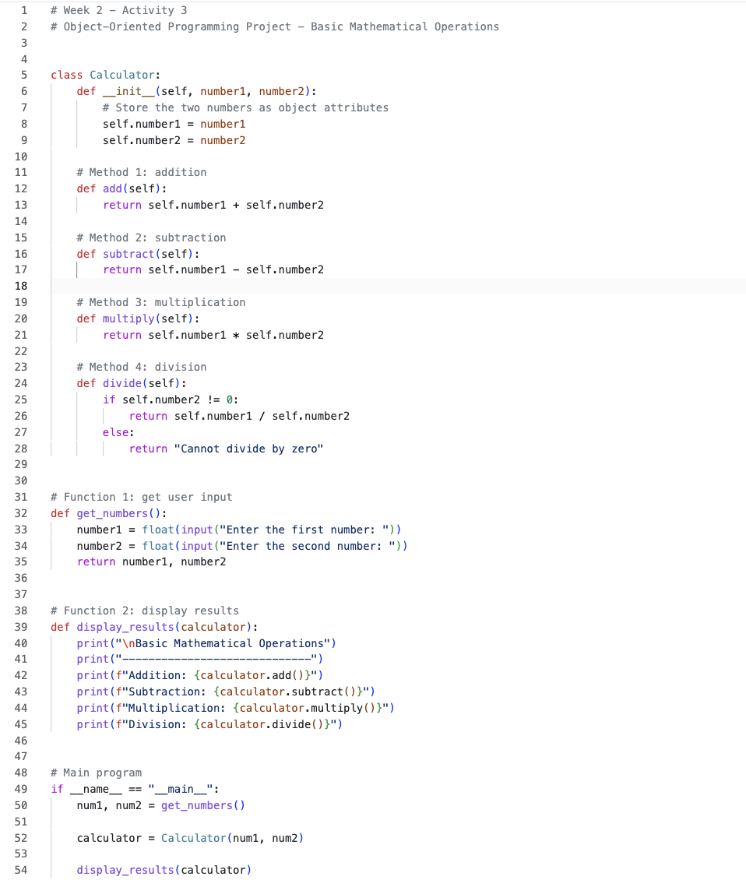
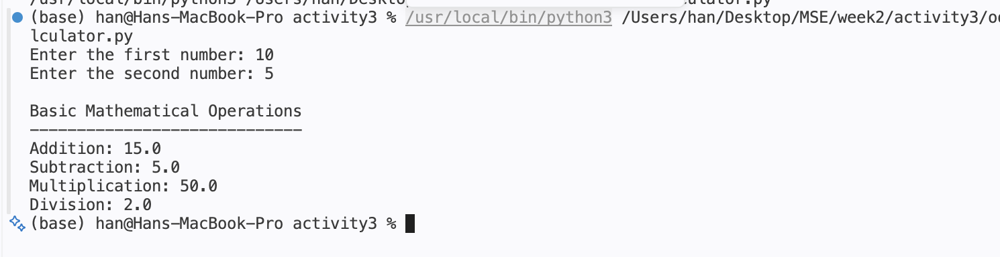

# Week 2 - Activity 3

## Object-Oriented Programming Project Development

### Basic Mathematical Operations

---

## Introduction

This project is a continuation of Week 2 Activity 1, which focused on basic mathematical operations. The project has been redesigned using Object-Oriented Programming (OOP) concepts to improve code organization, reusability, and maintainability.

The program allows users to enter two numbers and perform basic mathematical operations including addition, subtraction, multiplication, and division. The calculations are performed using methods defined inside a Calculator class.

---

## Project Objectives

The objectives of this project are:

- To demonstrate the use of Object-Oriented Programming concepts.
- To create a reusable Calculator class.
- To practice the use of classes, objects, attributes, methods, and functions.
- To perform basic mathematical operations using user input.

---

## Technologies and Tools Used

- Python 3
- Visual Studio Code (VS Code)
- Git
- GitHub

---

## OOP Concepts Used

### Class

The project uses one class:

python class Calculator: 

The Calculator class represents a calculator object that stores two numbers and performs mathematical operations.

---

### Object

An object is created from the Calculator class:

python calculator = Calculator(num1, num2) 

The object contains the numbers entered by the user and can access all methods defined in the class.

---

### Attributes

The class stores two attributes:

python self.number1 self.number2 

These attributes store the numbers entered by the user.

---

### Methods

The Calculator class contains four methods:

python add() subtract() multiply() divide() 

#### add()

Returns the sum of two numbers.

#### subtract()

Returns the difference between two numbers.

#### multiply()

Returns the product of two numbers.

#### divide()

Returns the quotient of two numbers and prevents division by zero.

---

### Functions

The project includes two functions:

#### get_numbers()

Collects two numbers from the user.

#### display_results()

Displays the results of all mathematical operations.

---

## Program Structure

text Calculator Class │ ├── add() ├── subtract() ├── multiply() └── divide()  Functions │ ├── get_numbers() └── display_results()  Main Program │ └── Creates Calculator Object     and displays results 

---

## Sample Output

text Enter the first number: 10 Enter the second number: 5  Basic Mathematical Operations ----------------------------- Addition: 15.0 Subtraction: 5.0 Multiplication: 50.0 Division: 2.0 

---

## Python Entry Point

The project uses the standard Python entry-point format:

python if __name__ == "__main__": 

This ensures the program runs only when the file is executed directly.

---

## Screenshots

### Code Screenshot

### Terminal Screenshot

---

## Skills Demonstrated

This project demonstrates the following Python concepts:

- Variables
- User Input
- Functions
- Classes
- Objects
- Attributes
- Methods
- Object-Oriented Programming (OOP)
- Conditional Statements
- Mathematical Operations
- Git and GitHub Workflow

---

## GitHub Repository

GitHub Repository Link:

https://github.com/osvaldvanstein6-Han/800_2

---

## Author

Han

MSE800 – Software Engineering

Week 2 Activity 3