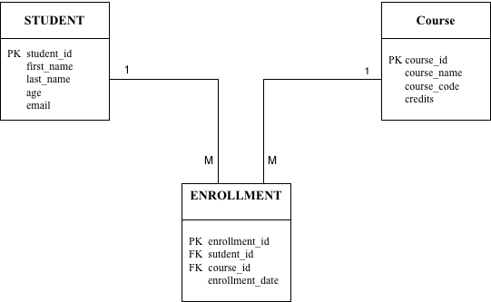

# Week 3 - Activity 1.1

## Database Design for Students and Courses

### Introduction

This activity focuses on designing a database for managing students and courses. An Entity Relationship Diagram (ER Diagram) is used to present the database structure and relationships between different entities.

The design includes three main entities: Student, Course, and Enrollment. These entities are connected to support student course enrollment and data management.

---

## ER Diagram

ER Diagram

---

## Entities

### STUDENT

The STUDENT entity stores information about students.

Attributes:

- student_id (Primary Key)
- first_name
- last_name
- age
- email

---

### COURSE

The COURSE entity stores information about courses.

Attributes:

- course_id (Primary Key)
- course_name
- course_code
- credits

---

### ENROLLMENT

The ENROLLMENT entity records which students are enrolled in which courses.

Attributes:

- enrollment_id (Primary Key)
- student_id (Foreign Key)
- course_id (Foreign Key)
- enrollment_date

---

## Relationships

The relationship between STUDENT and COURSE is many-to-many.

- One student can enroll in many courses.
- One course can have many students.

To resolve this many-to-many relationship, the ENROLLMENT entity is used as a bridge table.

Relationship summary:

- STUDENT (1) → (M) ENROLLMENT
- COURSE (1) → (M) ENROLLMENT

---

## Database Design Benefits

This database design:

- Reduces duplicated data.
- Improves data organization.
- Supports multiple course enrollments.
- Maintains data integrity through primary and foreign keys.

---

## Technologies Used

- Draw.io (ER Diagram Design)
- Git
- GitHub

---

## Author

Han

MSE800 – Software Engineering

Week 3 Activity 1.1# Week 3 - Activity 1.1

## Database Design for Students and Courses

### Introduction

This activity focuses on designing a database for managing students and courses. An Entity Relationship Diagram (ER Diagram) is used to present the database structure and relationships between different entities.

The design includes three main entities: Student, Course, and Enrollment. These entities are connected to support student course enrollment and data management.

---

## ER Diagram

ER Diagram

---

## Entities

### STUDENT

The STUDENT entity stores information about students.

Attributes:

- student_id (Primary Key)
- first_name
- last_name
- age
- email

---

### COURSE

The COURSE entity stores information about courses.

Attributes:

- course_id (Primary Key)
- course_name
- course_code
- credits

---

### ENROLLMENT

The ENROLLMENT entity records which students are enrolled in which courses.

Attributes:

- enrollment_id (Primary Key)
- student_id (Foreign Key)
- course_id (Foreign Key)
- enrollment_date

---

## Relationships

The relationship between STUDENT and COURSE is many-to-many.

- One student can enroll in many courses.
- One course can have many students.

To resolve this many-to-many relationship, the ENROLLMENT entity is used as a bridge table.

Relationship summary:

- STUDENT (1) → (M) ENROLLMENT
- COURSE (1) → (M) ENROLLMENT

---

## Database Design Benefits

This database design:

- Reduces duplicated data.
- Improves data organization.
- Supports multiple course enrollments.
- Maintains data integrity through primary and foreign keys.

---

## Technologies Used

- Draw.io (ER Diagram Design)
- Git
- GitHub

---

## Author

Han

MSE800 – Software Engineering

Week 3 Activity 1.1# Week 3 - Activity 1.1

## Database Design for Students and Courses

### Introduction

This activity focuses on designing a database for managing students and courses. An Entity Relationship Diagram (ER Diagram) is used to present the database structure and relationships between different entities.

The design includes three main entities: Student, Course, and Enrollment. These entities are connected to support student course enrollment and data management.

---

## ER Diagram

ER Diagram

---

## Entities

### STUDENT

The STUDENT entity stores information about students.

Attributes:

- student_id (Primary Key)
- first_name
- last_name
- age
- email

---

### COURSE

The COURSE entity stores information about courses.

Attributes:

- course_id (Primary Key)
- course_name
- course_code
- credits

---

### ENROLLMENT

The ENROLLMENT entity records which students are enrolled in which courses.

Attributes:

- enrollment_id (Primary Key)
- student_id (Foreign Key)
- course_id (Foreign Key)
- enrollment_date

---

## Relationships

The relationship between STUDENT and COURSE is many-to-many.

- One student can enroll in many courses.
- One course can have many students.

To resolve this many-to-many relationship, the ENROLLMENT entity is used as a bridge table.

Relationship summary:

- STUDENT (1) → (M) ENROLLMENT
- COURSE (1) → (M) ENROLLMENT

---

## Database Design Benefits

This database design:

- Reduces duplicated data.
- Improves data organization.
- Supports multiple course enrollments.
- Maintains data integrity through primary and foreign keys.

---

## Technologies Used

- Draw.io (ER Diagram Design)
- Git
- GitHub

---

## Author

Han

MSE800 – Software Engineering

Week 3 Activity 1.1# Week 3 - Activity 1.1

## Database Design for Students and Courses

### Introduction

This activity focuses on designing a database for managing students and courses. An Entity Relationship Diagram (ER Diagram) is used to present the database structure and relationships between different entities.

The design includes three main entities: Student, Course, and Enrollment. These entities are connected to support student course enrollment and data management.

---

## ER Diagram

ER Diagram

---

## Entities

### STUDENT

The STUDENT entity stores information about students.

Attributes:

- student_id (Primary Key)
- first_name
- last_name
- age
- email

---

### COURSE

The COURSE entity stores information about courses.

Attributes:

- course_id (Primary Key)
- course_name
- course_code
- credits

---

### ENROLLMENT

The ENROLLMENT entity records which students are enrolled in which courses.

Attributes:

- enrollment_id (Primary Key)
- student_id (Foreign Key)
- course_id (Foreign Key)
- enrollment_date

---

## Relationships

The relationship between STUDENT and COURSE is many-to-many.

- One student can enroll in many courses.
- One course can have many students.

To resolve this many-to-many relationship, the ENROLLMENT entity is used as a bridge table.

Relationship summary:

- STUDENT (1) → (M) ENROLLMENT
- COURSE (1) → (M) ENROLLMENT

---

## Database Design Benefits

This database design:

- Reduces duplicated data.
- Improves data organization.
- Supports multiple course enrollments.
- Maintains data integrity through primary and foreign keys.

---

## Technologies Used

- Draw.io (ER Diagram Design)
- Git
- GitHub

---

## Screenshot

## Author

Han

