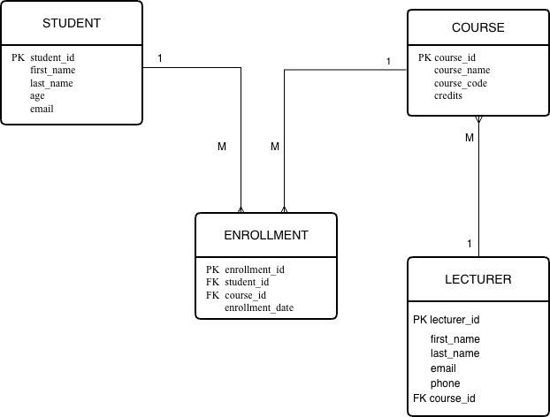

# Week 3 - Activity 1.2

## Updated Database Design for Students, Courses and Lecturers

### Introduction

This activity is an extension of Week 3 Activity 1.1. The original database design included three entities: STUDENT, COURSE, and ENROLLMENT. In this updated version, a new entity called LECTURER has been added to support lecturer management and demonstrate a more complete database structure.

The Entity Relationship Diagram (ER Diagram) shows how students enroll in courses and how lecturers are associated with courses.

---

## Updated ER Diagram

Updated ER Diagram

---

## Entities

### STUDENT

The STUDENT entity stores information about students.

Attributes:

- student_id (Primary Key)
- first_name
- last_name
- age
- email

---

### COURSE

The COURSE entity stores information about courses.

Attributes:

- course_id (Primary Key)
- course_name
- course_code
- credits

---

### ENROLLMENT

The ENROLLMENT entity records student enrolments in courses.

Attributes:

- enrollment_id (Primary Key)
- student_id (Foreign Key)
- course_id (Foreign Key)
- enrollment_date

The ENROLLMENT entity acts as a bridge table between STUDENT and COURSE.

---

### LECTURER

The LECTURER entity stores information about lecturers who teach courses.

Attributes:

- lecturer_id (Primary Key)
- first_name
- last_name
- email
- phone
- course_id (Foreign Key)

The course_id foreign key links lecturers to courses.

---

## Relationships

### STUDENT and ENROLLMENT

One student can have many enrollments.

Relationship:

- STUDENT (1) → (M) ENROLLMENT

---

### COURSE and ENROLLMENT

One course can have many enrollments.

Relationship:

- COURSE (1) → (M) ENROLLMENT

---

### COURSE and LECTURER

One course can be associated with multiple lecturers.

Relationship:

- COURSE (1) → (M) LECTURER

---

## Database Design Benefits

This database design provides several advantages:

- Reduces duplicated data.
- Maintains data integrity through primary and foreign keys.
- Supports student enrollment management.
- Supports lecturer and course management.
- Demonstrates the use of entity relationships in database design.
- Provides a scalable structure for future system development.

---

## Primary Keys and Foreign Keys

### Primary Keys (PK)

- student_id
- course_id
- enrollment_id
- lecturer_id

Primary keys uniquely identify each record in a table.

### Foreign Keys (FK)

- student_id (in ENROLLMENT)
- course_id (in ENROLLMENT)
- course_id (in LECTURER)

Foreign keys are used to establish relationships between entities.

---

## Technologies Used

- Draw.io (ER Diagram Design)
- Git
- GitHub

---

## Screenshot

## Author

Han

