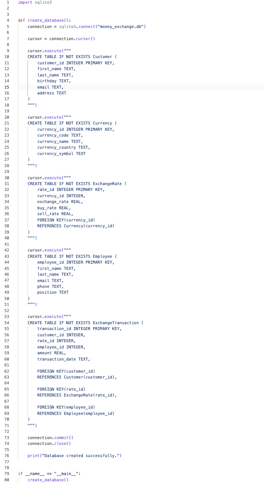
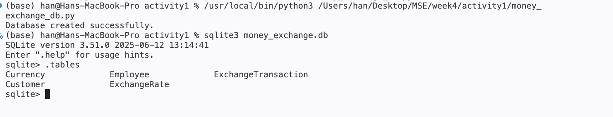

# Week 4 - Activity 1

## Money Exchange Database Using SQLite3

### Introduction

This project develops a SQLite3 database for a finance money exchange application based on the ER Diagram designed in Week 3 Activity 2.

The database stores information about customers, currencies, exchange rates, employees, and transactions. SQLite3 was used to create and manage the database tables.

---

## Database File

Database Name:

money_exchange.db

Programming Language:

Python 3

Database Technology:

SQLite3

---

## Total Tables Created

A total of 5 tables were created:

1. Customer
2. Currency
3. ExchangeRate
4. Employee
5. ExchangeTransaction

---

## Table Descriptions

### Customer

This table stores customer information.

Why is it necessary?

Every money exchange transaction must be associated with a customer.

---

### Currency

This table stores information about supported currencies.

Why is it necessary?

The system needs to know which currencies are available for exchange.

---

### ExchangeRate

This table stores exchange rate information.

Why is it necessary?

Exchange rates are used to calculate currency conversion values.

---

### Employee

This table stores employee information.

Why is it necessary?

Employees process customer transactions and their information must be recorded.

---

### ExchangeTransaction

This table stores transaction records.

Why is it necessary?

This is the central table of the system. It records all money exchange transactions and links customers, employees, and exchange rates together.

---

## Relationships

- Customer (1) → (M) ExchangeTransaction
- Employee (1) → (M) ExchangeTransaction
- ExchangeRate (1) → (M) ExchangeTransaction
- Currency (1) → (M) ExchangeRate

---

## Technologies Used

- Python 3
- SQLite3
- VS Code
- Git
- GitHub

---

## Screenshot

## Author˚√

Han

