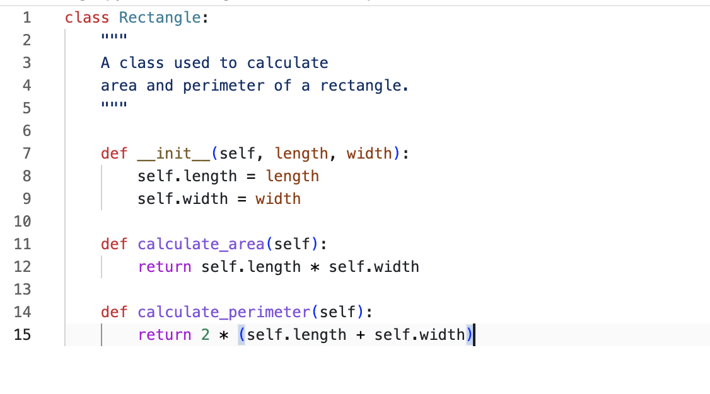
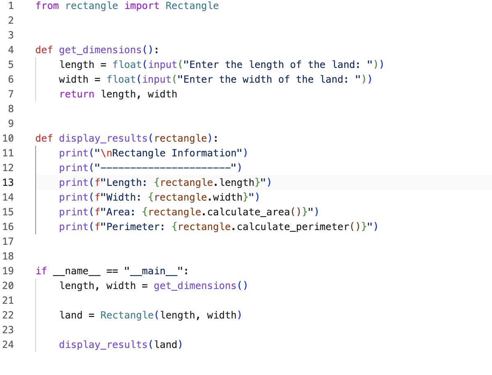
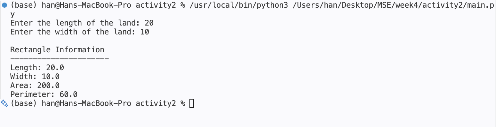

# Week 4 - Activity 2

## Object-Oriented Programming Project for Area and Perimeter

### Introduction

This project is an Object-Oriented Programming (OOP) application developed in Python. The program allows users to enter the dimensions of a rectangular piece of land and calculates its area and perimeter.

The project demonstrates the use of classes, objects, methods, functions, and multiple Python files. The design follows OOP principles by separating the Rectangle class from the main program logic.

---

## Project Objectives

The objectives of this project are:

- To practice Object-Oriented Programming concepts.
- To create and use a class in Python.
- To calculate the area and perimeter of a rectangle.
- To organize code into multiple Python files.
- To improve code readability and maintainability.

---

## Technologies and Tools Used

- Python 3
- Visual Studio Code (VS Code)
- Git
- GitHub

---

## Project Structure

The project consists of the following files:

text activity2 │ ├── rectangle.py ├── main.py ├── README.md ├── coding_screenshot.png └── terminal_screenshot.png 

### rectangle.py

Contains the Rectangle class and its methods.

### main.py

Contains user input functions, output functions, and the main program execution.

---

## OOP Concepts Used

### Class

The project uses one class:

python class Rectangle: 

The Rectangle class represents a rectangular piece of land.

---

### Object

An object is created from the Rectangle class:

python land = Rectangle(length, width) 

The object stores the dimensions entered by the user.

---

### Attributes

The class contains two attributes:

python self.length self.width 

These attributes store the dimensions of the rectangle.

---

### Methods

The Rectangle class contains two methods:

#### calculate_area()

Calculates and returns the area of the rectangle.

Formula:

Area = Length × Width

#### calculate_perimeter()

Calculates and returns the perimeter of the rectangle.

Formula:

Perimeter = 2 × (Length + Width)

---

### Functions

The project includes two functions:

#### get_dimensions()

Collects the length and width entered by the user.

#### display_results()

Displays the rectangle information, area, and perimeter.

---

## Program Flow

text User Input      │      ▼ Create Rectangle Object      │      ▼ Calculate Area      │      ▼ Calculate Perimeter      │      ▼ Display Results 

---

## Sample Output

text Enter the length of the land: 20 Enter the width of the land: 10  Rectangle Information ---------------------- Length: 20.0 Width: 10.0 Area: 200.0 Perimeter: 60.0 

---

## Python Entry Point

The project uses the standard Python entry-point format:

python if __name__ == "__main__": 

This ensures that the program runs only when the file is executed directly.

---

## Screenshots

### Code Screenshot

Coding Screenshot

### Terminal Screenshot

Terminal Screenshot

---

## Skills Demonstrated

This project demonstrates the following concepts:

- Variables
- User Input
- Functions
- Classes
- Objects
- Attributes
- Methods
- Object-Oriented Programming (OOP)
- Mathematical Calculations
- Modular Programming
- Git and GitHub Workflow

---

## GitHub Repository

GitHub Repository Link:

https://github.com/osvaldvanstein6-Han/800_2

---

## Screenshot

___

## Author

Han

