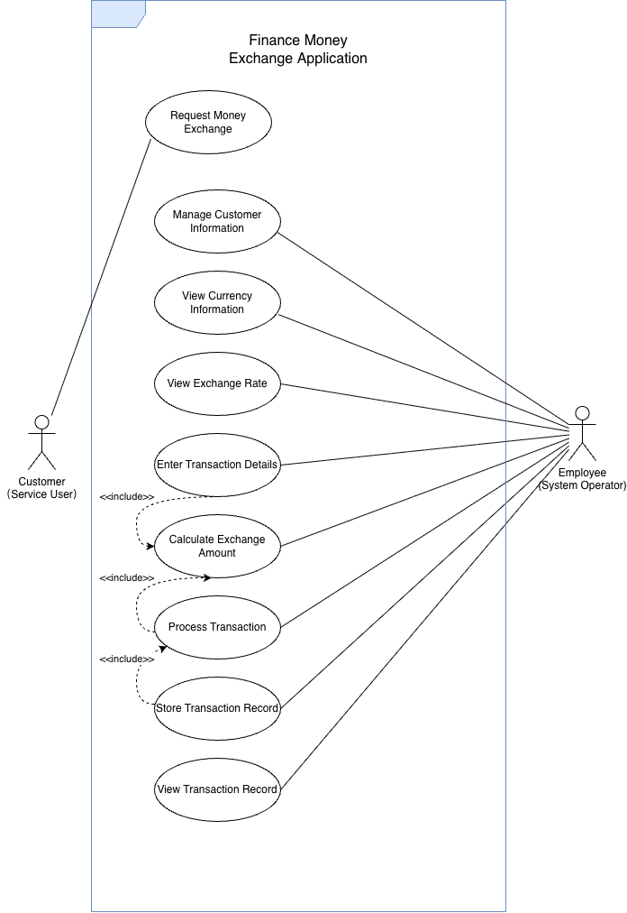

# Week 5 - Activity 1

## Optimized W4-A1: Use Case Diagram for Finance Money Exchange Application

---

# Introduction

This project is a continuation of Week 4 Activity 1, which focused on developing a Finance Money Exchange Application using SQLite3. The purpose of this activity is to identify the system scope, define user interactions, and represent the functionality of the application through a Use Case Diagram.

The Use Case Diagram illustrates how different users interact with the system and how the system supports the money exchange process.

---

# Scenario

A customer visits a money exchange service and requests to exchange money from one currency to another. An employee uses the Finance Money Exchange Application to process the transaction.

The employee first manages customer information and verifies customer details. The employee then views available currencies and checks the current exchange rate. After entering the transaction details, the system calculates the exchange amount. The employee processes the transaction, stores the transaction record in the database, and can later view transaction records if required.

The application supports customer management, currency information management, exchange rate viewing, transaction processing, and transaction record storage.

---

# System Scope

The Finance Money Exchange Application is designed to support the following functions:

- Customer information management
- Currency information viewing
- Exchange rate viewing
- Transaction detail entry
- Exchange amount calculation
- Transaction processing
- Transaction record storage
- Transaction record viewing

The system scope is limited to money exchange operations and transaction management. The application does not include online banking integration or payment gateway services.

---

# Actors

## Customer (Service User)

The customer is the person who requests a currency exchange service.

Responsibilities:

- Request money exchange

---

## Employee (System Operator)

The employee operates the system and manages all exchange transactions.

Responsibilities:

- Manage customer information
- View currency information
- View exchange rates
- Enter transaction details
- Calculate exchange amount
- Process transactions
- Store transaction records
- View transaction records

---

# Use Cases

## Request Money Exchange

Allows customers to request a currency exchange service.

## Manage Customer Information

Allows employees to add, update, delete, and view customer details.

## View Currency Information

Allows employees to view available currencies in the system.

## View Exchange Rate

Allows employees to check exchange rates between currencies.

## Enter Transaction Details

Allows employees to enter transaction information, including currency type and amount.

## Calculate Exchange Amount

Calculates the converted amount based on the selected exchange rate.

## Process Transaction

Processes and confirms the exchange transaction.

## Store Transaction Record

Stores completed transaction information in the database.

## View Transaction Record

Allows employees to review previous transaction records.

---

# Use Case Relationships

The system includes several dependent processes:

text Enter Transaction Details         ↓ Calculate Exchange Amount         ↓ Process Transaction         ↓ Store Transaction Record 

These relationships are represented using the <<include>> relationship in the Use Case Diagram.

---

# Use Case Diagram

The following diagram illustrates the interaction between actors and the Finance Money Exchange Application.

Use Case Diagram

---

# Skills Demonstrated

This project demonstrates the following concepts:

- UML Use Case Diagram Design
- System Analysis
- System Scope Definition
- Actor Identification
- Use Case Identification
- Include Relationships
- Business Process Modeling
- Software Design Documentation

---

# GitHub Repository

GitHub Repository Link:

https://github.com/osvaldvanstein6-Han/800_2

---

## Screenshot

# Author

Han

