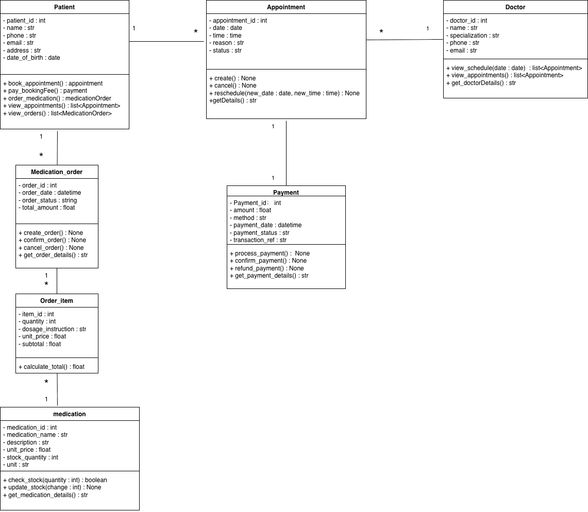

# Week 5 - Activity 3: Class Diagram for a Clinic System

## Project Overview

This activity focuses on designing a UML Class Diagram for a Clinic System. The system allows patients to book appointments, pay booking fees, and order medication. The class diagram was created to model the main classes, attributes, methods, and relationships within the system.

## System Description

The Clinic System supports three main functions:

1. Patients can book appointments with doctors.
2. Patients can pay appointment booking fees.
3. Patients can order medications from the clinic.

The design follows Object-Oriented Programming (OOP) principles and uses UML Class Diagram notation to represent the system structure.

---

## Classes Included

### Patient

Represents a patient who uses the clinic system.

Responsibilities:

- Book appointments
- Pay booking fees
- Order medication
- View appointments
- View medication orders

### Doctor

Represents a doctor working in the clinic.

Responsibilities:

- View schedules
- View appointments
- Manage doctor information

### Appointment

Represents an appointment between a patient and a doctor.

Responsibilities:

- Create appointments
- Cancel appointments
- Reschedule appointments
- Store appointment information

### Payment

Represents a payment record for an appointment.

Responsibilities:

- Process payments
- Confirm payments
- Refund payments
- Store payment details

### MedicationOrder

Represents a medication order created by a patient.

Responsibilities:

- Create medication orders
- Confirm orders
- Cancel orders
- Store order information

### OrderItem

Represents an individual medication item within an order.

Responsibilities:

- Store medication quantity
- Store dosage instructions
- Calculate item totals

### Medication

Represents medication available in the clinic.

Responsibilities:

- Check stock availability
- Update stock quantities
- Store medication information

---

## Relationships

The following relationships are defined in the class diagram:

- One Patient can have many Appointments.
- One Doctor can have many Appointments.
- One Appointment has one Payment.
- One Patient can create many Medication Orders.
- One Medication Order can contain many Order Items.
- Many Order Items can reference one Medication.

---

## Design Decisions

The class names follow UML naming conventions using PascalCase.

Attributes use Python-style snake_case naming.

Methods represent the main behaviours of each class and reflect the functional requirements of the clinic system.

This design provides a clear representation of the system structure and can be used as the foundation for future implementation in Python.

---

## Screenshot

---

## Files Included

- Class_diagram_patient_appointment_doctor1.png
- README.md

---

## Conclusion

The Clinic System Class Diagram successfully models the main entities and operations required for appointment booking, payment processing, and medication ordering. The design demonstrates the use of UML Class Diagrams to support object-oriented system analysis and design.