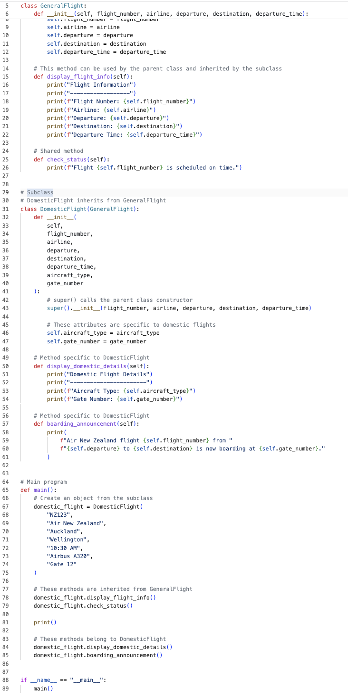
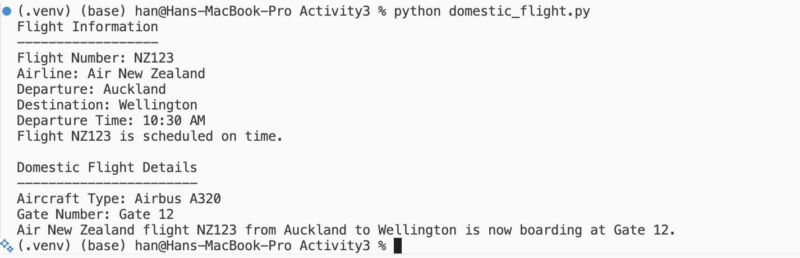

# Activity 8 - Activity 3

## Single Inheritance - Air New Zealand Domestic Flight System

### Project Description

This project demonstrates the concept of Single Inheritance in Python using an Air New Zealand domestic flight system.

The parent class, GeneralFlight, represents a general flight and contains common flight information such as flight number, airline, departure location, destination, and departure time.

The subclass, DomesticFlight, inherits all attributes and methods from GeneralFlight and adds domestic-flight-specific information such as aircraft type and gate number.

This project demonstrates the use of inheritance, code reuse, and object-oriented programming principles in Python.

---

## Class Diagram


```text
+----------------------+
|    GeneralFlight     |
+----------------------+
| flight_number        |
| airline              |
| departure            |
| destination          |
| departure_time       |
+----------------------+
| display_flight_info()|
| check_status()       |
+----------------------+
           ▲
           |
           |
+----------------------+
|   DomesticFlight     |
+----------------------+
| aircraft_type        |
| gate_number          |
+----------------------+
| display_domestic_details() |
| boarding_announcement()    |
+----------------------+
```

---

## Inheritance Relationship

- Parent Class: GeneralFlight
- Child Class: DomesticFlight

The DomesticFlight class inherits the attributes and methods of the GeneralFlight class.

---

## Technologies Used

- Python
- Visual Studio Code
- Git
- GitHub

---


## How to Run

```bash
python domestic_flight.py
```

---

## Example Output

## Example Output

```text
Flight Information
------------------
Flight Number: NZ123
Airline: Air New Zealand
Departure: Auckland
Destination: Wellington
Departure Time: 10:30 AM
Flight NZ123 is scheduled on time.

Domestic Flight Details
-----------------------
Aircraft Type: Airbus A320
Gate Number: Gate 12
Air New Zealand flight NZ123 from Auckland to Wellington is now boarding at Gate 12.
```

---

## Screenshot




## Author

Han 

## Acknowledgement

AI tools were used for learning support and code explanation.

