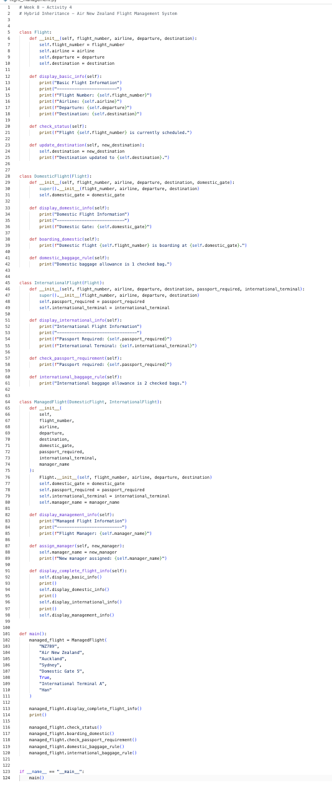
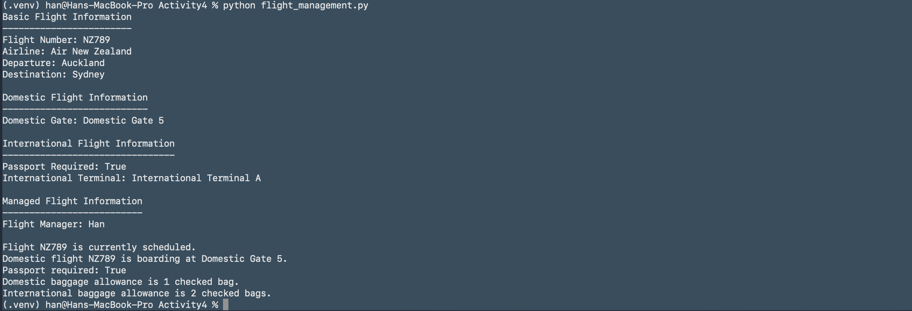

# Week 8 - Activity 4

## Hybrid Inheritance - Air New Zealand Flight Management System

## Project Description

This project updates Week 8 Activity 3 by redesigning the flight system to support both domestic and international flights operated by Air New Zealand.

The project demonstrates Hybrid Inheritance in Python. The base class `Flight` contains shared flight attributes and methods. The classes `DomesticFlight` and `InternationalFlight` inherit from `Flight`, showing hierarchical inheritance. The class `ManagedFlight` inherits from both `DomesticFlight` and `InternationalFlight`, showing multiple inheritance. Together, these inheritance types form hybrid inheritance.

## Screenshot




## Class Diagram

```text
+-----------------------------+
|           Flight            |
+-----------------------------+
| - flight_number             |
| - airline                   |
| - departure                 |
| - destination               |
+-----------------------------+
| + display_basic_info()      |
| + check_status()            |
| + update_destination()      |
+-----------------------------+
          ▲             ▲
          |             |
+------------------+   +------------------------+
| DomesticFlight   |   | InternationalFlight    |
+------------------+   +------------------------+
| - domestic_gate  |   | - passport_required    |
|                  |   | - international_terminal |
+------------------+   +------------------------+
| + display_domestic_info() |
| + boarding_domestic()     |
| + domestic_baggage_rule() |
+------------------+   +------------------------+
                       | + display_international_info() |
                       | + check_passport_requirement() |
                       | + international_baggage_rule() |
                       +------------------------+
          ▲             ▲
          |             |
          +-------------+
                |
+-----------------------------+
|        ManagedFlight        |
+-----------------------------+
| - manager_name              |
+-----------------------------+
| + display_management_info() |
| + assign_manager()          |
| + display_complete_flight_info() |
+-----------------------------+

## How to Run

```bash
python flight_management.py
```

## Inheritance Explanation

- Flight is the parent class.
- DomesticFlight inherits from Flight.
- InternationalFlight inherits from Flight.
- ManagedFlight inherits from both DomesticFlight and InternationalFlight.

This structure demonstrates Hybrid Inheritance because it combines hierarchical inheritance and multiple inheritance.

## Example Output

```text
Basic Flight Information
------------------------
Flight Number: NZ789
Airline: Air New Zealand
...
```

## Author

Han