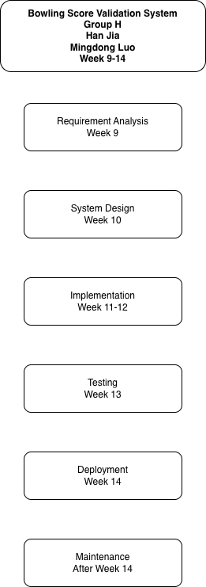

# Week 9 - Activity 1

## Project Title
Bowling Score Validation System

## Group Name
Group H

## Team Members
- Han Jia
- Mingdong Luo

## Project Overview

The Bowling Score Validation System is designed to validate bowling score entries and calculate player scores according to official bowling scoring rules. The system includes membership management, score history tracking, permission control, and score editing restrictions.

## Waterfall Methodology

The project follows the Waterfall model, where each phase is completed before moving to the next phase.

### Project Schedule

| Phase | Timeline |
|---------|----------|
| Requirements Analysis | Week 9 |
| System Design | Week 10 |
| Development | Week 11 - Week 12 |
| Testing | Week 13 |
| Deployment | Week 14 |
| Maintenance | After Week 14 |

## Waterfall Diagram

See the attached waterfall_diagram.png file.

