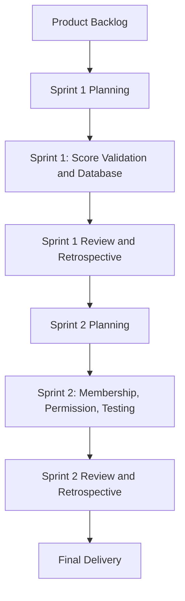
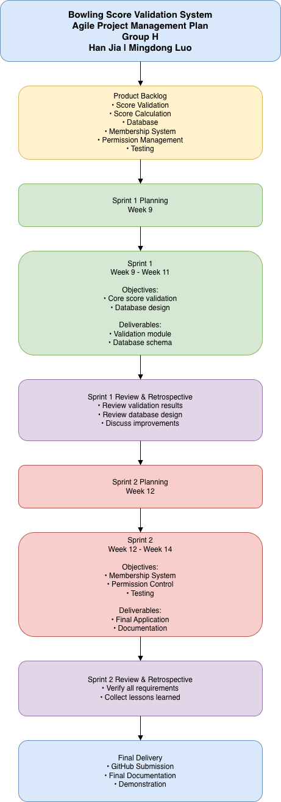

# Agile Methodology

## Project Information

**Project Title:**  
Bowling Score Validation System

**Group Name:**  
Group H

**Team Members:**
- Han Jia
- Mingdong Luo

---

## Introduction

This project uses the Agile methodology to manage the development of the Bowling Score Validation System. Agile is suitable for this project because it allows the team to divide the work into smaller iterations called sprints. Each sprint delivers a working part of the system and provides opportunities for review, testing, and improvement.

The project will be completed in two sprints. Sprint 1 focuses on the core bowling score validation and database functions, while Sprint 2 focuses on membership management, permission control, testing, and final delivery.

---

## Agile Project Management Diagram

---

## Product Backlog

The product backlog contains all major features required by the Bowling Score Validation System:

- User score entry
- Bowling score validation
- Strike calculation
- Spare calculation
- Final score calculation
- Database storage
- Membership management
- Permission management
- Score history records
- Ten-minute editing rule
- System testing
- Project documentation

---

# Sprint 1: Core Score Validation and Database

**Duration:** Week 9 – Week 11

## Objectives

Develop the core functionality of the Bowling Score Validation System, including score validation, score calculation, and database design.

## Tasks

- Analyse bowling scoring rules
- Design database schema
- Create user and score tables
- Implement score validation logic
- Implement strike and spare calculations
- Develop score calculation module
- Store score records in the database
- Create a basic user interface

## Deliverables

- Database schema
- Score validation module
- Score calculation module
- Basic working prototype
- Sprint 1 documentation

## Outcomes

At the end of Sprint 1, users can enter bowling scores, validate inputs, calculate final scores, and save score records successfully.

## Sprint Review

The team reviews whether score validation, strike and spare calculations, and database storage functions work correctly.

## Sprint Retrospective

The team discusses challenges encountered during development and identifies improvements for Sprint 2.

---

# Sprint 2: Membership, Permission, Testing, and Final Delivery

**Duration:** Week 12 – Week 14

## Objectives

Complete the remaining features and prepare the final version of the Bowling Score Validation System.

## Tasks

- Implement membership management
- Implement permission management
- Restrict non-members to viewing the last 7 days of records
- Allow members unlimited access to score history
- Implement the 10-minute editing rule
- Conduct system testing
- Fix identified bugs
- Prepare final project documentation
- Upload project to GitHub

## Deliverables

- Membership module
- Permission management module
- Editing restriction feature
- Fully tested application
- Final documentation
- GitHub repository submission

## Outcomes

At the end of Sprint 2, the Bowling Score Validation System is fully functional and ready for demonstration and submission.

## Sprint Review

The team verifies that all project requirements have been completed and that the application functions correctly.

## Sprint Retrospective

The team reflects on project performance, discusses lessons learned, and identifies future improvements.

---

# Team Responsibilities

| Team Member | Responsibilities |
|-------------|------------------|
| Han Jia | Database design, score validation, score calculation, documentation |
| Mingdong Luo | Membership management, permission management, testing support |
| Both Members | Sprint reviews, bug fixing, final documentation, GitHub submission |

---

# Progress Updates

## Sprint 1 Progress

- Project requirements identified
- Database design completed
- Score validation module developed
- Score calculation module implemented

## Sprint 2 Progress

- Membership system completed
- Permission management completed
- Editing restriction feature implemented
- System testing completed
- Final documentation completed

---

# Future Improvements

Future enhancements may include:

- AI-powered chatbot support
- Cloud deployment
- Advanced score analytics
- User dashboard
- Mobile-friendly interface

---

# Agile Diagram

---

# Conclusion

The Agile methodology enables the team to divide the Bowling Score Validation System into manageable sprints and deliver features incrementally. Through Sprint 1 and Sprint 2, the team can develop, test, review, and improve the system effectively while ensuring that all project requirements are completed before final submission.